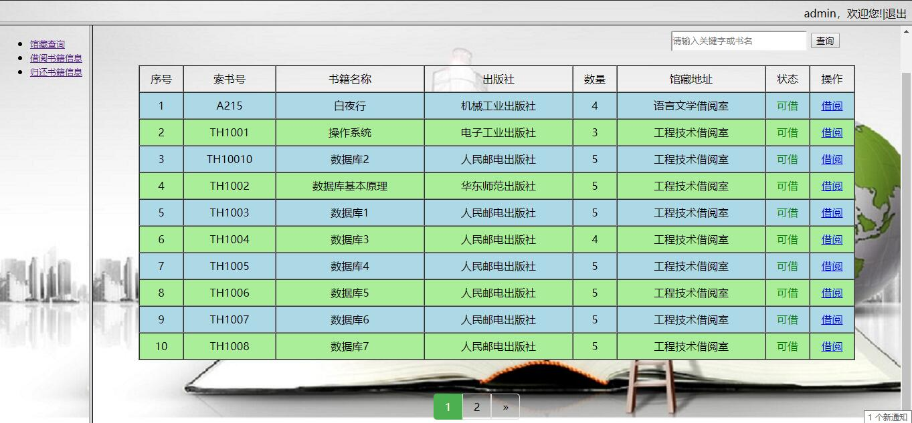
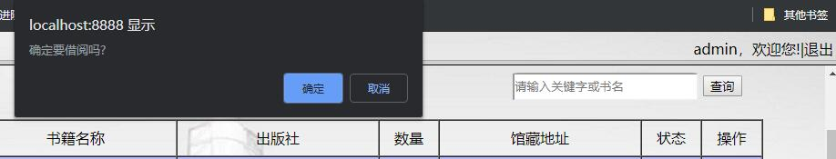
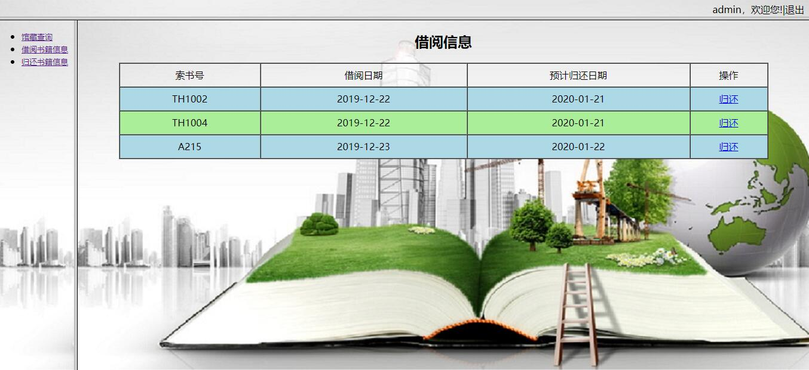
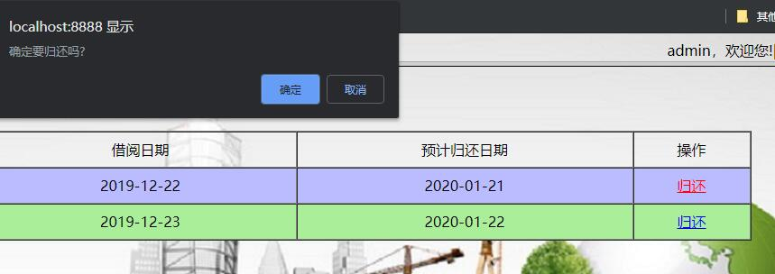
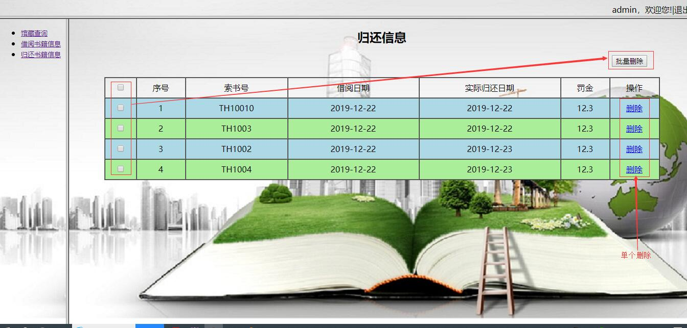

# 图书借阅系统

## 1. 功能模块

该系统主要功能有：用户登陆、用户注册、馆藏查询、借书、还书、查看历史借阅信息等功能。

## 2. 采用的技术

JavaBean、JDBC、jsp、jstl标签、EL表达式、AJAX、BeanUtils封装对象等。

## 3. 功能模块代码实现

### 3.1 用户登陆


**login.jsp实现代码：**

```jsp
<%@ page language="java" contentType="text/html; charset=UTF-8"
	pageEncoding="UTF-8"%>
<!DOCTYPE html PUBLIC "-//W3C//DTD HTML 4.01 Transitional//EN" "http://www.w3.org/TR/html4/loose.dtd">
<html>
<head>
<meta charset="UTF-8">
<title>登陆</title>
<style type="text/css">
#mydiv1 {
	width: 400px;
	height: 250px;
	background-color: #ccc;
	text-align: center;
	margin-top: 10px;
	position: relative;
	border-radius: 1%;
	left: 500px;
	top: 150px;
}

#mydiv2 {
	width: 350px;
	height: 200px;
	text-align: center;
	line-height: 40px;
	position: absolute;
	margin-top: 20px;
}

.inp {
	width: 200px;
	height: 30px;
	border-radius: 5%;
	outline: none;
}

a {
	text-decoration: none;
}

body{
   background-image:url(static/img/bg.jpg);
   background-repeat: no-repeat
}
</style>
</head>
<body>
	<div align="right">
		<a href="register.jsp">去注册</a>
	</div>

	<div id="mydiv1">
		<div id="mydiv2">
			<form action="${pageContext.request.contextPath}/loginServlet"
				method="post">
				<p>
					<label>用户名：</label><input type="text" name="username"
						placeholder="请输入用户名" class="inp" />
				</p>
				<p>
					<label>密&nbsp;&nbsp;码：</label><input type="password"
						name="password" placeholder="请输入密码" class="inp" />
				</p>
				<p>
					<input type="submit" name="btn1" value="登陆" /> <input type="reset"
						name="btn2" value="取消" />
				</p>
			</form>
			<p>
				<a href="register.jsp">还没有注册?去注册</a>
			</p>
		</div>
	</div>
</body>
</html>
```


**主要实现逻辑**：

​         用户输入用户名、密码，点击“登陆”按钮，向后台提交参数username和password，后台根据username和password从数据库library中的user表中查询用户信息。如果查到了相应的用户，页面跳转到馆藏查询页面；如果未查到相应的用户，页面继续停留在login.jsp页面。可以继续登陆操作。若想要去注册，用户可以点击右上角的“去注册按钮”或表单上的“xxx注册xxx”跳转到注册页面。

**逻辑实现代码：**

​        后台`LoginServlet.java`获取参数`username`和`password`信息，然后将参数传入业务逻辑层的`loginUser(username, password)` 。

```java
 @WebServlet("/loginServlet")
public class LoginServlet extends HttpServlet{

	private static final long serialVersionUID = 1L;

	@Override
	protected void doGet(HttpServletRequest req, HttpServletResponse resp) throws ServletException, IOException {
		//设置编码格式
		req.setCharacterEncoding("utf-8");
		resp.setContentType("text/html;charset=utf-8");
		
		//获取用户名和密码
		String username = req.getParameter("username");
		String password = req.getParameter("password");
		
		//判断用户是否存在
		UserService service = new UserServiceImpl();
		User loginUser = service.loginUser(username, password);
		
		if(loginUser!=null){//登陆成功
			HttpSession session = req.getSession();
			session.setAttribute("user", loginUser);
			req.getRequestDispatcher("/main.jsp").forward(req, resp);
		}else{//登陆失败
			req.getRequestDispatcher("/login.jsp").forward(req, resp);
		}
	}

	@Override
	protected void doPost(HttpServletRequest req, HttpServletResponse resp) throws ServletException, IOException {
		
		doGet(req, resp);
	}
}
```


​        业务逻辑层调用数据访问层的`loginUser(String username,String password)`方法，获取从数据库里面查询到的User对象信息。

```java
public interface UserService{
  //登陆。根据用户名和密码查询信息
  User loginUser(String username,String password);
}

```

**对应的实现方法：**

```java

	@Override
	public User loginUser(String username, String password) {
		User loginUser = userDAO.loginUser(username, password);
		return loginUser;
	}
```

**数据访问层的实现：**

```java
public interface UserDAO {
  //登陆。根据用户名和密码查询信息
  User loginUser(String username,String password);
}
```

**对应的实现方法：**

```java
@Override
	public User loginUser(String username, String password) {
		Connection conn=null;
		PreparedStatement pst=null;
		ResultSet rs=null;
		User user = null;
		try {
			conn = JDBCUtil.getConn();
			String sql = "select * from user where username=? and password=?";
			pst = conn.prepareStatement(sql);
			pst.setString(1, username);
			pst.setString(2, password);
			rs = pst.executeQuery();
			while(rs.next()){
				user = new User();
				user.setUserId(rs.getInt("userId"));
				user.setUsername(rs.getString("username"));
				user.setPassword(rs.getString("password"));
				user.setEmail(rs.getString("email"));
			}
		} catch (SQLException e) {
			e.printStackTrace();
		}finally{
			try {
				if(rs!=null){
					rs.close();
					}
					if(pst!=null){
					pst.close();
					}
					
					if(conn!=null){
						conn.close();
					}
			} catch (SQLException e) {
				e.printStackTrace();
			}
		}
		
		return user;
	}
```


**用户登陆过滤器：**

用户登陆时，判断用户是否登陆，若没有登陆，不能跳转到馆藏信息展示页面。

```java
/*登陆验证的过滤器*/
@WebFilter()  //拦截所有请求
public class LoginFilter implements Filter{

	@Override
	public void doFilter(ServletRequest arg0, ServletResponse arg1, FilterChain chain)
			throws IOException, ServletException {
		
		HttpServletRequest req = (HttpServletRequest)arg0;
		HttpServletResponse resp = (HttpServletResponse)arg1;
		
		//获取用户请求的URI
		String uri = req.getRequestURI();
		//放行用户登陆页面
		if(uri.contains("login.jsp")){
			doFilter(req, resp, chain);
		}
		
		//获取session对象
		HttpSession session = req.getSession();
		//获取登陆用户信息
		User user = (User)session.getAttribute("user");
		if(user==null){//当用户对象为null，表示用户还没有登陆，跳转到登陆页面
			resp.sendRedirect(req.getContextPath()+"/login.jsp");
		}else{
		//表示用户登陆成功，放行
		doFilter(req, resp, chain);
		}
	}

}
```

### 3.2 用户注册


**register.jpg页面代码：**

```jsp
<%@ page language="java" contentType="text/html; charset=UTF-8"
	pageEncoding="UTF-8"%>
<!DOCTYPE html PUBLIC "-//W3C//DTD HTML 4.01 Transitional//EN" "http://www.w3.org/TR/html4/loose.dtd">
<html>
<head>
<meta charset="UTF-8">
<title>注册页面</title>
<script src="static/js/jquery-3.3.1.js"></script>

<style type="text/css">

body{
   background-image:url(static/img/bg.jpg);
}
#mydiv1 {
	width: 400px;
	height: 250px;
	background-color: #ccc;
	text-align: center;
	margin-top: 10px;
	position: relative;
	border-radius: 1%;
	left: 500px;
	top: 150px;
}

#mydiv2 {
	width: 350px;
	height: 200px;
	text-align: center;
	line-height: 40px;
	position: absolute;
	margin-top: 20px;
}

.inp {
	width: 200px;
	height: 30px;
	border-radius: 5%;
	outline: none;
	padding: 0px 5px;
}

a {
	text-decoration: none;
}

</style>

</head>

<body>
   <div align="right">
       <a href="login.jsp">返回登陆</a>
   </div>
	<div id="mydiv1">
		<div id="mydiv2">
			<form action="${pageContext.request.contextPath}/registerServlet"
				method="post">
				<p>
					<label>用户名：</label><input type="text" name="username"
						placeholder="请输入用户名" class="inp" id="username" />
				</p>
				<p>
					<label>密&nbsp;&nbsp;码：</label><input type="password"
						name="password" placeholder="请输入密码" class="inp" id="pwd" />
				</p>
				<p>
					<label>密&nbsp;&nbsp;码：</label><input type="email" name="email"
						placeholder="请输入邮箱" class="inp" id="email" />
				</p>
				<p>
					<input type="submit" name="btn1" value="提交" /> <input type="reset"
						name="btn2" value="重置" />
				</p>
			</form>
		</div>
	</div>
</body>
<script type="text/javascript">
	$("#username")
			.blur(
					function() {
						var val = $(this).val();
						if (val == null || val == "") {
							alert("用户名不能为空！");
						} else {
							$
									.ajax({
										type : "get",
										url : "${pageContext.request.contextPath}/checkName?   username="+ val,
										dataType:"json",
										async : true,
										success : function(result) {
											if(result.userExist){
												alert("该用户名太受欢迎了，换一个!");
											}else{
												alert("该用户名可用!");
											}
										}
									});
						}
					});

	$("#pwd").blur(function() {
		var val = $(this).val();
		if (val == null || val == "") {
			alert("密码不能为空!");
		} else if (val.length < 6) {
			alert("密码太短了!");
		}
	});
</script>
</html>
```


**主要实现逻辑：**

​        在该页面中，用户输入注册的用户信息，若用户的用户名、密码、邮箱格式输入不正确，在input框失焦后，会出现弹框提示信息；若输入的用户名是注册过的（即：数据库中已存在该用户名），也会出现弹框提示信息“该用户名太受欢迎了，换一个!”。用户点击“提交”按钮向后台提交数据。如果注册成功，跳转到登陆页面；未注册成功，继续停留在注册页面。

**逻辑实现代码：**

```java
@WebServlet("/registerServlet")
public class RegisterServlet extends HttpServlet{

	private static final long serialVersionUID = 1L;

	@Override
	protected void doGet(HttpServletRequest req, HttpServletResponse resp) throws ServletException, IOException {
		//设置编码格式
		req.setCharacterEncoding("utf-8");
		
		Map<String, String[]> map = req.getParameterMap();
		
		//封装User对象
		User user = new User();
		try {
			BeanUtils.populate(user, map);
		} catch (IllegalAccessException e) {
			e.printStackTrace();
		} catch (InvocationTargetException e) {
			e.printStackTrace();
		}
		
		UserService service = new UserServiceImpl();
		boolean flag = service.addUser(user);
		if(flag){
			//注册成功，去登陆
			resp.sendRedirect(req.getContextPath()+"/login.jsp");
		}else{
			//注册失败，继续注册
			resp.sendRedirect(req.getContextPath()+"/register.jsp");
		}
	}

	@Override
	protected void doPost(HttpServletRequest req, HttpServletResponse resp) throws ServletException, IOException {
		
		doGet(req, resp);
	}
}
```

获取注册表单传递过来的数据，调用业务逻辑层的addUser(user)方法。

业务逻辑层代码：

```java
//用户业务逻辑层
public interface UserService {
	//用户注册
	public boolean addUser(User user);
}
```

对应的实现类：

```java
//用户注册
	@Override
	public boolean addUser(User user) {
		boolean flag = userDAO.addUser(user);
		return flag;
	}
```

业务逻辑层调用数据访问层的addUser(User user)方法，向数据库的user表插入数据。


数据访问层代码：

```java
public interface UserDAO {
  //向用户表插入数据
  boolean addUser(User user);
}
```

对应的实现类：

```java
/*向用户表插入数据*/
	@Override
	public boolean addUser(User user) {
		Connection conn=null;
		PreparedStatement pst=null;
		ResultSet rs=null;
		boolean flag = false;
		try {
			conn = JDBCUtil.getConn();
			String sql = "insert into user(userId,username,password,email) values(null,?,?,?)";
			pst = conn.prepareStatement(sql);
			pst.setString(1, user.getUsername());
			pst.setString(2, user.getPassword());
			pst.setString(3, user.getEmail());
			int add = pst.executeUpdate();
			if(add>0){
				flag=true;
			}
			
		} catch (SQLException e) {
			e.printStackTrace();
		}finally{
			try {
				if(rs!=null){
					rs.close();
					}
					if(pst!=null){
					pst.close();
					}
					
					if(conn!=null){
						conn.close();
					}
			} catch (SQLException e) {
				e.printStackTrace();
			}
		}	
		return flag;
	}
```


判断注册的用户名是否重复：

使用ajax向后台提交数据，后台向前台响应一个结果：

```jsp
<body>
   <p>
	<label>用户名：</label><input type="text" name="username" placeholder="请输入用户名" class="inp" id="username" />
  </p>
</body>

<script type="text/javascript">
	$("#username")
			.blur(
					function() {
						var val = $(this).val();
						if (val == null || val == "") {
							alert("用户名不能为空！");
						} else {
							$
									.ajax({
										type : "get",
										url : "${pageContext.request.contextPath}/checkName?username="
												+ val,
										dataType:"json",
										async : true,
										success : function(result) {
											if(result.userExist){
												alert("该用户名太受欢迎了，换一个!");
											}else{
												alert("该用户名可用!");
											}
										}
									});
						}
					});

	$("#pwd").blur(function() {
		var val = $(this).val();
		if (val == null || val == "") {
			alert("密码不能为空!");
		} else if (val.length < 6) {
			alert("密码太短了!");
		}
	});
</script>
```

验证用户名是否重复的servlet实现代码：

```java
@WebServlet("/checkName")
public class CheckNameServlet extends HttpServlet{

	private static final long serialVersionUID = 1L;

	@Override
	protected void doGet(HttpServletRequest req, HttpServletResponse resp) throws ServletException, IOException {
		//设置字符编码格式
		req.setCharacterEncoding("utf-8");
		resp.setContentType("application/json;charset=utf-8");
		
		//获取文本框中的name
		String username = req.getParameter("username");
		//根据用户名查询用户信息
		UserService service = new UserServiceImpl();
		boolean result = service.getUserByName(username);
		
		Map<String, Object> map = new HashMap<String, Object>();
		map.put("userExist", result);
		ObjectMapper mapper = new ObjectMapper();
		mapper.writeValue(resp.getWriter(), map);
	}

	@Override
	protected void doPost(HttpServletRequest req, HttpServletResponse resp) throws ServletException, IOException {
		doGet(req, resp);
	}
}
```

​         在该servlet中，实现的功能有：获取用户名信息，根据用户名调用业务逻辑层对应的getUserByName(String username)方法返回结果信息，将返回的结果信息保存到Map集合中，以JSON的形式传递到前台。

业务逻辑层代码实现：

```java
//用户业务逻辑层
public interface UserService {
	//根据用户名查询用户信息
	public boolean getUserByName(String username);
}
```

对应的实现类：

```java
	
//根据用户名查询用户列表
	@Override
	public boolean getUserByName(String username) {
		List<User> list = userDAO.getUserByName(username);
		boolean flag = false;
		if(list.size()>0){
			flag = true;
		}
		return flag;
	}
```

业务逻辑层调用数据访问层中对应的方法。具体实现代码：

```java
public interface UserDAO {
  //根据用户名查询用户信息
  List<User> getUserByName(String username);
}
```

对应的实现方法：

```java
//根据用户名查询用户信息
	@Override
	public List<User> getUserByName(String username) {
		Connection conn=null;
		PreparedStatement pst=null;
		ResultSet rs=null;
		User user = null;
		List<User> list = null;
		try {
			conn = JDBCUtil.getConn();
			String sql = "select * from user where username=?";
			pst = conn.prepareStatement(sql);
			pst.setString(1, username);
			rs = pst.executeQuery();
			
			list = new ArrayList<User>();
			
			while(rs.next()){
				user = new User();
				user.setUserId(rs.getInt("userId"));
				user.setUsername(rs.getString("username"));
				user.setPassword(rs.getString("password"));
				user.setEmail(rs.getString("email"));
				list.add(user);
			}
		} catch (SQLException e) {
			e.printStackTrace();
		}finally{
			try {
				if(rs!=null){
					rs.close();
					}
					if(pst!=null){
					pst.close();
					}
					
					if(conn!=null){
						conn.close();
					}
			} catch (SQLException e) {
				e.printStackTrace();
			}
		}	
		return list;
	}

```

### 3.3 馆藏查询



 

​    登陆成功后或者点击“馆藏查询”进入馆藏查询的主页面。在该页面中，分页显示了馆藏信息，可以进行图书借阅操作。点击“借阅”，弹出提示框，提示是否借阅，确定，借阅成功，馆藏数量-1。




馆藏查询主要实现：

   点击“馆藏查询”连接或者登陆成功过，即可显示馆藏信息。

```jsp
<frame
				src="${pageContext.request.contextPath }/selectBookByPage?curPage=1&rows=10"
				name="right" style="background-image:url(static/img/bg.jpg)"/

```

馆藏信息展示页面实现

```jsp
<html>

<head>
<meta http-equiv="Content-Type" content="text/html; charset=UTF-8">
<title>展示页面-全选全不选</title>
<script src="<%=request.getContextPath()%>/static/js/jquery-3.3.1.js"
	type="text/javascript"></script>
<%-- <link href="<%=request.getContextPath() %>/static/bootstrap.min.css" rel="stylesheet">
    <script src="$<%=request.getContextPath() %>/static/bootstrap.min.js"></script> --%>

<style type="text/css">
body {
	text-align: center;
}

#tb {
	margin: auto;
}

#tb tr td, h2 {
	text-align: center;
}

#div1 {
	width: 93%;
	text-align: right;
	margin-bottom: 20px;
}

#search_inp {
	width: 200px;
	height: 25px;
	border-radius: 5%;
	outline: none;
}

#tb tr {
	height: 40px;
}

/* 分页条 */

ul.pagination {
    display: inline-block;
    padding: 0;
    margin: 0;
}

ul.pagination li {display: inline;}

ul.pagination li a {
    color: black;
    float: left;
    padding: 8px 16px;
    text-decoration: none;
    transition: background-color .3s;
    border: 1px solid #ddd;
}

.pagination li:first-child a {
    border-top-left-radius: 5px;
    border-bottom-left-radius: 5px;
}

.pagination li:last-child a {
    border-top-right-radius: 5px;
    border-bottom-right-radius: 5px;
}

ul.pagination li a.active {
    background-color: #4CAF50;
    background-color：green;
    color: white;
    border: 1px solid #4CAF50;
}

ul.pagination li a:hover:not(.active) {background-color: #ddd;}
#pageInfo{
   margin-right:60px;
   margin-top:50px;
}

</style>

</head>

<body>

	<%-- <%
		List<Book> bookList = (List<Book>) session.getAttribute("bookList");
	%> --%>
	<h2>书籍信息</h2>
	<form action="${pageContext.request.contextPath}/selectBookByPage" method="get">
		<div id="div1">
			<input type="text" name="bookNameWithKey" placeholder="请输入关键字或书名"
				id="search_inp"> <input type="submit" id="search" value="查询">
		</div>
	</form>
	<div>
		<table id="tb" width="90%" height="100%" border="1px solid"
			cellspacing="0" cellpadding="0" class="table table-bordered">
			<thead>
				<tr>
					<td>序号</td>
					<td>索书号</td>
					<td>书籍名称</td>
					<td>出版社</td>
					<td>数量</td>
					<td>馆藏地址</td>
					<td>状态</td>
					<td>操作</td>
				</tr>
			</thead>

			<tbody id="tb2">
				<c:forEach items="${pageBean.list}" var="book" varStatus="status">
					<tr>
						<td>${status.count}</td>
						<td>${book.bookNo}</td>
						<td>${book.bookName}</td>
						<td>${book.publishAddr}</td>
						<td>${book.bookNum}</td>
						<td>${book.roomAddr}</td>
						<td><c:if test="${book.bookNum <= 0}">
								<font color="red">不可借</font>
							</c:if> <c:if test="${book.bookNum > 0}">
								<font color="green">可借</font>
							</c:if></td>
						<td><a type="button" class="borrowBtn"
							href="javascript:borrow(${user.userId },'${book.bookNo}')"> 借阅 </a></td>
					</tr>
				</c:forEach>
		</table>
		
		<div width="100%" height="200px" border="1px" id="pageInfo">
		     <ul class="pagination">
		        
		         <c:if test="${pageBean.curPage>1}">
		            <li>
		               <a href="${pageContext.request.contextPath}/selectBookByPage?curPage=${pageBean.curPage-1}&rows=10">&laquo</a>
		            </li>
		        </c:if>
		        
		        <c:forEach begin="1" end="${pageBean.totalPage }" var="i">
		          <li> 
		             <c:if test="${pageBean.curPage == i}">
		                  <a href="${pageContext.request.contextPath}/selectBookByPage?curPage=${i}&rows=10" class="active">${i}</a>
		             </c:if>
		              <c:if test="${pageBean.curPage != i}">
		                  <a href="${pageContext.request.contextPath}/selectBookByPage?curPage=${i}&rows=10">${i}</a>
		             </c:if>
		           </li>
		        </c:forEach>
		         <c:if test="${pageBean.curPage<pageBean.totalPage}">
		            <li>
		               <a href="${pageContext.request.contextPath}/selectBookByPage?curPage=${pageBean.curPage+1}&rows=10">&raquo</a>
		            </li>
		        </c:if>
		     </ul>
		</div>

	</div>


</body>

<script type="text/javascript">
	var tbRow = document.getElementById("tb2").rows;

	for (var i = 0; i < tbRow.length; i++) {
		if (tbRow[i].rowIndex % 2 == 1) {
			tbRow[i].style.backgroundColor = "lightblue";
			tbRow[i].onmouseover = function() {
				this.style.backgroundColor = "#bbf";
			}

			tbRow[i].onmouseout = function() {
				this.style.backgroundColor = "lightblue";
			}
		} else {
			tbRow[i].style.backgroundColor = "#ae9";
			tbRow[i].onmouseover = function() {
				this.style.backgroundColor = "#88b";
			}

			tbRow[i].onmouseout = function() {
				this.style.backgroundColor = "#ae9";
			}
		}
	}

	function borrow(userId, bookNo) {
		if (confirm("确定要借阅吗?")) {
			location.href = "${pageContext.request.contextPath}/borrowBook?userId="
					+ userId + "&bookNo=" + bookNo;
		}
	}
</script>

</html>
```

servlet层：

```java
@WebServlet("/selectBookByPage")
public class SelectBookByPage extends HttpServlet{

	private static final long serialVersionUID = 1L;

	@Override
	protected void doGet(HttpServletRequest req, HttpServletResponse resp) throws ServletException, IOException {
		//设置编码格式
		req.setCharacterEncoding("utf-8");
		resp.setContentType("text/html;charset=utf-8");
		
		//获取url上携带的参数信息curPage,rows
		String strCurPage = req.getParameter("curPage");
		String strRows = req.getParameter("rows");
		//获取模糊查询条件
		String bookNameWithKey = req.getParameter("bookNameWithKey");
		//System.out.println(bookName);
		
		//程序做健壮性判断
		if(strCurPage==null||"".equals(strCurPage)||Integer.parseInt(strCurPage)<=1){
			strCurPage = "1";
		}
		
		if(strRows == null||"".equals(strRows)){
			strRows = "10";
		}
		
		//获取PageBean对象
		UserService service = new UserServiceImpl();
		PageBean<Book> pageBean = service.findBookByPage(Integer.parseInt(strCurPage), Integer.parseInt(strRows),bookNameWithKey);
	
		HttpSession session = req.getSession();
		session.setAttribute("pageBean", pageBean);
		req.getRequestDispatcher("/book.jsp").forward(req, resp);
	}

	@Override
	protected void doPost(HttpServletRequest req, HttpServletResponse resp) throws ServletException, IOException {
		doGet(req, resp);
	}
}
```

业务逻辑层：

```java
//用户业务逻辑层
public interface UserService {
	//分页查询
	public PageBean<Book> findBookByPage(int curPage,int rows,String bookNameWithKey);
}

```

对应的实现类：

```java
/*
    * 显示分页信息
    */
	@Override
	public PageBean<Book> findBookByPage(int curPage,int rows,String bookNameWithKey) {
		//1. 创建一个空的PageBean对象
		PageBean<Book> pageBean = new PageBean<Book>();
		//2. 获取总的记录数
		int totalCount = bookDAO.getTotalCount(bookNameWithKey);
		//3. 获取总页码数
		int totalPage = totalCount%rows==0?totalCount/rows:totalCount/rows+1;
		//4.每一页显示的信息
		//4.1 获取每一页的开始记录数
		int start = (curPage-1)*rows;
		//4.2 获取每一页显示的信息集合
		List<Book> list = bookDAO.getBookByPage(start, rows,bookNameWithKey);
		
		//封装PageBean对象
		pageBean.setTotalCount(totalCount);
		pageBean.setCurPage(curPage);
		pageBean.setRows(rows);
		pageBean.setTotalPage(totalPage);
		pageBean.setList(list);
		
		return pageBean;
	}
```

数据访问层：

```java
public interface BookDAO {
	//获取馆藏的总记录条数
	int getTotalCount(String bookNameWithKey);
	
	//分页查询
	List<Book> getBookByPage(int start,int rows,String bookNameWithKey);
}
```

对应的实现类：

```java
	// 获取总记录条数
	@Override
	public int getTotalCount(String bookNameWithKey) {
		Connection conn = null;
		PreparedStatement pst = null;
		ResultSet rs = null;
		String sql = null;
		int totalCount = 0; // 总记录条数，默认为0条
		try {
			conn = JDBCUtil.getConn();
			sql = "select count(*) totalCount from book where 1=1 ";
			StringBuilder sb = null;
			if (bookNameWithKey != null) {
				sb = new StringBuilder(sql);
				sb.append(" and bookName like ?");
				sql = sb.toString();
				pst = conn.prepareStatement(sql);
				pst.setString(1, "%" + bookNameWithKey + "%");
			} else {
				
				pst = conn.prepareStatement(sql);
			}

			rs = pst.executeQuery();
			while (rs.next()) {
				totalCount = rs.getInt("totalCount");
			}
		} catch (SQLException e) {
			e.printStackTrace();
		} finally {
			try {
				if (rs != null) {
					rs.close();
				}
				if (pst != null) {
					pst.close();
				}

				if (conn != null) {
					conn.close();
				}

			} catch (SQLException e) {
				e.printStackTrace();
			}
		}

		return totalCount;
	}

	/* 分页查询 */
	@Override
	public List<Book> getBookByPage(int start, int rows, String bookNameWithKey) {
		Connection conn = null;
		PreparedStatement pst = null;
		ResultSet rs = null;
		String sql = null;
		List<Book> list = null;
		try {
			conn = JDBCUtil.getConn();
			sql = "select book.bookNo bookNo,book.bookName bookName,"
					+ "book.bookNum bookNum,book.publishAddr publishAddr,"
					+ "book.author author,bookroom.roomAddr roomAddr from book,"
					+ "bookroom where book.roomId=bookroom.roomId ";

			StringBuilder sb = new StringBuilder(sql);
			if (bookNameWithKey != null) {

				sb.append(" and bookName like ?");
				sb.append(" limit ?,?");

				sql = sb.toString();
				//System.out.println(sql);

				pst = conn.prepareStatement(sql);
				pst.setString(1, "%" + bookNameWithKey + "%");
				pst.setInt(2, start);
				pst.setInt(3, rows);
			} else {
				sb.append(" limit ?,?");
				sql = sb.toString();
				//System.out.println(sql);

				pst = conn.prepareStatement(sql);
				pst.setInt(1, start);
				pst.setInt(2, rows);
			}

			rs = pst.executeQuery();

			list = new ArrayList<>();
			while (rs.next()) {
				Book book = new Book();
				book.setBookNo(rs.getString("bookNo"));
				book.setBookName(rs.getString("bookName"));
				book.setRoomAddr(rs.getString("roomAddr"));
				book.setBookNum(rs.getInt("bookNum"));
				book.setAuthor(rs.getString("author"));
				book.setPublishAddr(rs.getString("publishAddr"));
				list.add(book);
			}
		} catch (SQLException e) {
			e.printStackTrace();
		} finally {
			try {
				if (rs != null) {
					rs.close();
				}
				if (pst != null) {
					pst.close();
				}

				if (conn != null) {
					conn.close();
				}

			} catch (SQLException e) {
				e.printStackTrace();
			}
		}
		return list;
	}
```

### 3.4 查看借阅信息



在该页面中，查看借阅书籍信息，可以执行“归还”还书操作。

在归还书籍时，弹出提示框，以进一步确认是否要归还图书。归还成功，归还信息删去一条。



当所借书籍都归还后，该页面可以返回馆藏页面。


### 3.5 借书信息历史记录



在该页面中可以查看用户的借书历史信息。用户可以通过“单项删除”和“批量删除”这两种方式删除历史记录信息。

在删除历史记录的时候，出现信息提示框，提高用户交互友好性。


当记录删完后：


### 3.6 退出

点击右上角的“退出”按钮，销毁session，返回登陆页面。

实现代码：

```jsp
<body>
		${sessionScope.user.username}，欢迎您!|<a href="${pageContext.request.contextPath}/loginoutServlet" target="_praint">退出</a>
	</body>
```

**注意：**

`target="_praint"` 必须要写，否则，在`frameset`搭建的框架中，无法跳转到`login.jsp`页面。


退出servlet：

```java
@WebServlet("/loginoutServlet")
public class LoginoutServlet extends HttpServlet{

	private static final long serialVersionUID = 1L;

	@Override
	protected void doGet(HttpServletRequest req, HttpServletResponse resp) throws ServletException, IOException {
		//设置编码格式
		req.setCharacterEncoding("utf-8");
		resp.setContentType("text/html;charset=utf-8");
		
		HttpSession session = req.getSession();
		//销毁session
		session.invalidate();
		//重定向到login.jsp页面
		resp.sendRedirect(req.getContextPath()+"/login.jsp");
	}

	@Override
	protected void doPost(HttpServletRequest req, HttpServletResponse resp) throws ServletException, IOException {
		doGet(req, resp);
	}
}
```

